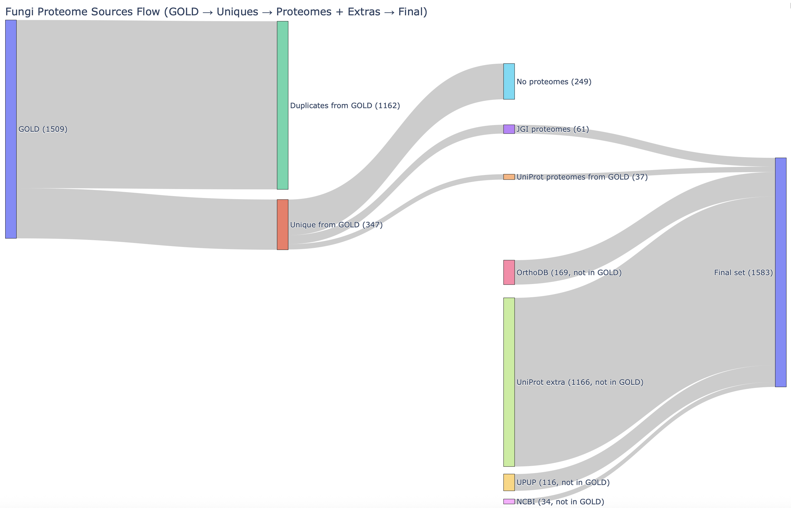

# Predicting Fungal Contaminants for Space Missions

<!-- [](https://www.python.org/downloads/)
[](https://opensource.org/licenses/MIT) -->

> **Official repository for the paper:** *"Predicting Fungal Contaminants for Space Missions Using Proteome-Wide Screening for Protein Orthologs"* by Ashish Mahabal, Vannsh Jani, S. George Djorgovski, Nitin K. Singh, and Swati Bijlani.



## Overview

Fungal contamination poses a growing threat to spacecraft integrity, crew health, and planetary protection efforts. This repository contains the scalable, automated Python pipeline used to identify fungi with adaptation potential to spaceflight-associated stress conditions (extreme temperatures, radiation, etc.) and pathogenicity risks.

The pipeline performs end-to-end proteome analysis:
1. **Extracts** proteomes from UniProt, NCBI, JGI GOLD, and OrthoDB.
2. **Runs BLASTp** comparisons against reference sets of 25 stress-resistance proteins.
3. **Summarizes** results into identity-based scores (S-score and A-score).
4. **Annotates** each organism with its taxonomic phylum.
5. **Generates** analytical matrices and visualizations.

---

## 💾 Data Availability

* **Metadata & Provenance:** The detailed source, database ID, and extraction date for all 1583 organisms evaluated in this study can be found in [`metadata/fasta_provenance.csv`](metadata/fasta_provenance.csv).
* **FASTA Files:** The full set of 1583 fungal proteome FASTA files can be downloaded from the Caltech Library at: *[Placeholder: Insert Caltech DOI Link Here]*
* **Primary Orthologs:** The top ortholog for each protein from each organism (including identity and coverage metrics) can be accessed at: *[Placeholder: Insert Caltech DOI Link Here]*

---

## ⚙️ Installation

To set up the pipeline locally:

```bash
# 1. Clone the repository
git clone https://github.com/VannshJani/Predicting-Fungal-Contaminants-for-Space-Missions.git
cd Fungi-Space-Contamination-Pipeline

# 2. Set up a virtual environment
python3 -m venv venv
source venv/bin/activate  # On Windows use: venv\Scripts\activate

# 3. Install dependencies
pip install -r requirements.txt

```

---

## 📖 Documentation & Guides

Depending on your use case, we have divided the documentation into three dedicated guides:

### 1. [Reproducing the Paper Results](docs/REPRODUCING.md)

Step-by-step instructions on how to use the scripts in the `src/` folder to download the 1583 FASTA files, run the BLASTp alignments, calculate the scores, and generate the exact plots and Excel summaries presented in our study.

### 2. [Extending the Pipeline (General Use)](docs/EXTENSION.md)

Instructions for researchers who want to use this pipeline for their own data. Learn how to add new fungal FASTA files, input different query proteins, and generate custom contamination potential reports.

### 3. [Streamlit Interactive Web App](docs/STREAMLIT_GUIDE.md)

Information on how to access and use our interactive web application to search for specific species or upload your own data for dynamic scoring. `link to github repository of application`: https://github.com/AshishMahabal/FungalContaminants

---

## 📝 Citation

If you use this code or our dataset in your research, please cite our paper:

```bibtex
@article{mahabal2025predicting,
  title={Predicting Fungal Contaminants for Space Missions Using Proteome-Wide Screening for Protein Orthologs},
  author={Mahabal, Ashish and Jani, Vannsh and Djorgovski, S. George and Singh, Nitin K. and Bijlani, Swati},
  year={2025},
  journal={TBD}
}

```

## Contact

For questions regarding the code or query FASTA files, please open an issue or contact [Vannsh Jani / Ashish Mahabal - add emails].
